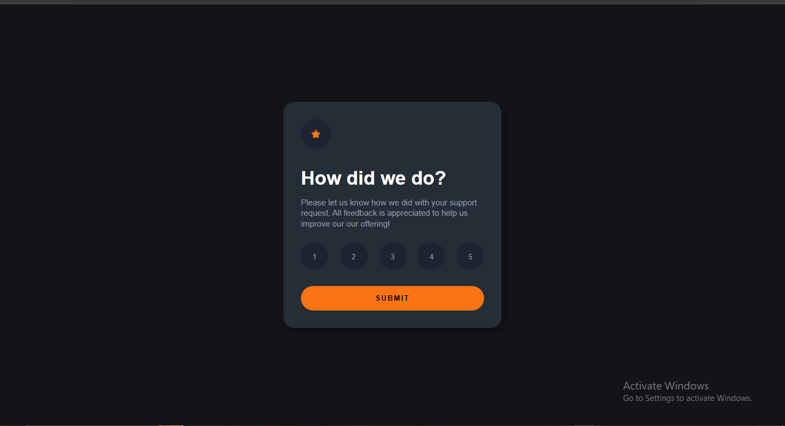

# Frontend Mentor - Interactive rating component solution

This is a solution to the [Interactive rating component challenge on Frontend Mentor](https://www.frontendmentor.io/challenges/interactive-rating-component-koxpeBUmI). Frontend Mentor challenges help you improve your coding skills by building realistic projects. 

## Table of contents

- [Overview](#overview)
  - [The challenge](#the-challenge)
  - [Screenshot](#screenshot)
  - [Links](#links)
- [My process](#my-process)
  - [Built with](#built-with)
  - [What I learned](#what-i-learned)
- [Author](#author)


## Overview

### The challenge

Users should be able to:

- View the optimal layout for the app depending on their device's screen size
- See hover states for all interactive elements on the page
- Select and submit a number rating
- See the "Thank you" card state after submitting a rating

### Screenshot




### Links

- Solution URL: [Add solution URL here](https://your-solution-url.com)
- Live Site URL: [Add live site URL here](https://your-live-site-url.com)

## My process

### Built with

- Semantic HTML5 markup
- CSS custom properties
- Flexbox
- CSS Grid
- Mobile-first workflow
- Javacript


### What I learned

I learnt how to change and connect two different interactive pages, learnt how to store a few information on one page of the website, that will be usefull to the other, learnt how to use the "hover","toggle()","add()" and "remove()" effect very well.
Still want to learn more.... 


```css
.ratings{
    margin-top: 25px;
    display: flex;
    justify-content: space-between;
}

.rate{
    color: hsl(217, 12%, 63%);
    margin-bottom: 30px;
    background-color: hsl(218, 25%, 15%);
    padding: 19px;
    border-radius: 100px;
    width: 50px;
    height: 50px;
    border: none;
}

.rate:hover{
    background-color: hsl(25, 97%, 53%);
    color: black;
    cursor: pointer;
}

.rate.active{
    background-color: white;
    color: black;
}

.submit{
    display: flex;
    justify-content: center;
    align-items: center;
}

.sub-btn{
    padding: 15px;
    border: none;
    width: 100%;
    border-radius: 30px;
    font-family: "overpass", sans-serif;
    text-transform: uppercase;
    font-weight: 700;
    letter-spacing: 2px;
    background-color: hsl(25, 97%, 53%);
}

.sub-btn:hover{
    background-color: #fff;
    cursor: pointer;
}
```
```js
submitBtn.addEventListener("click", () => {
   if(!selectedRating) {
    alert("Please choose the rating first");
    return;
    }


   selectedText.innerText = `You selected ${selectedRating} out of 5`;

   ratingState.classList.add("hidden");
   thankYouState.classList.remove("hidden");

});
```


### Continued development

I will learn how to do a lot of multipage website and be able to go through them without having issues in the future and also try to be eloquent with javascript.


## Author
- Frontend Mentor - [@Wizdev0](https://www.frontendmentor.io/profile/Wizdev0)
- Twitter - [@otutech](https://www.twitter.com/otutech)

